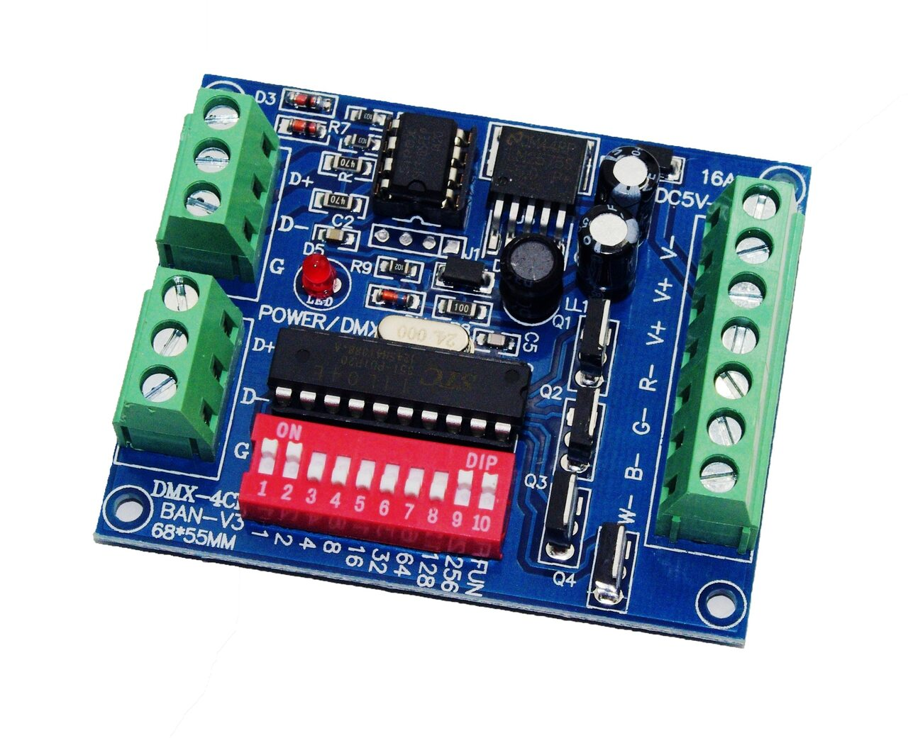
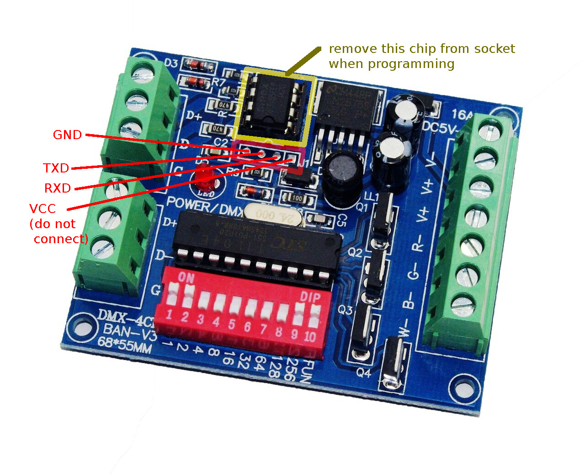
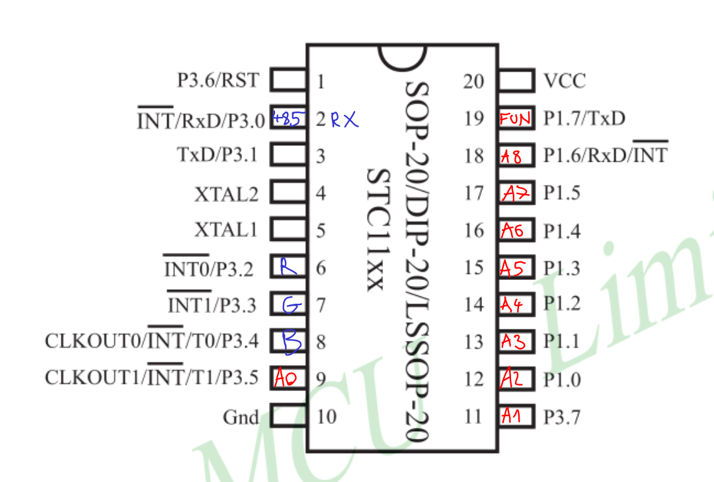

# Alternative firmware for "WS-DMX-BAN" cheap Chinese LED dimmers with high-frequency PWM

## What, why

You can buy very cheap Chinese LED strip dimmers from [AliExpress][], controlled over
an RS-485 bus using the [DMX512 protocol][DMX512]. Unfortunately, they operate at
a PWM frequency of circa 200 Hz, which can cause eye strain, headaches and other
unpleasant effects.

They are powered by an STC11Fxx or similar CPU by STC MCU (depending on
revision and number of channels; the 3- and 4-channel versions I saw use
STC11L04E) based on the Intel 8051 architecture.

The CPU itself runs at 24 MHz, so I was quite convinced that it could generate
higher frequencies. The basic trick is to not use interrupts and generate PWM
by directly toggling GPIO pins in a tight loop. This way, I was able to achieve
reliable 32 kHz PWM output with 64 brightness steps:

## Status

Currently works usably using a custom communication protocol. DMX is not implemented.

## Supported devices

Currently tested on:

  * `WS-DMX-3CH BAN-V2` (STC11L04E)
  * `WS-DMX-4CH BAN-V3` (STC11L04E)

## Build and install

To build it, you need the [sdcc][] compiler (packaged in many distros). Then
just run `make`.

To flash the CPU, you can use an unpopulated programming header one the board:

Just solder a pin header or some wires to it.

You can connect it to a 3.3V USB-UART converter (RX-TX, TX-RX, GND-GND). Do not
connect VCC and instead power the board from a 12V power supply, as you would
during normal use.

Before flashing, you must remove the RS485 decoder chip from its socket because
it will also try to drive the CPU's RX pin, which would interfere with the
programming communication.

You can then flash it using [stcgal][]:

    stcgal ws-dmx-ban-hw-pwm.ihx

After running the command, power cycle your board (disconnect and reconnect 12V
power supply).

*Warning: this permanently erases the original firmware. There is no way to back
it up or restore it. This may brick your device.* (But in my opinion, it is pretty
useless with the original firmware so well worth the risk.)

After flashing, it should light up all channels at 50%. You can send it commands
over the UART that you used for programming.

When satisfied, you can disconnect the programming UART, put back the RS485
receiver chip and you should be able to send the same commands over RS485.

## Communication protocol

Communication protocol is unidirectional, there is no message confirmation (the DMX module
only has RS485 receiver, no transmitter, so it cannot send anything). It consists of messages,
each 7 bytes in length. It consists of:

  * The message-start byte (253).
  * Target device address (251 = broadcast), as set by the DIP switches (DIP switch
    labelled "1" is LSB).
  * Four bytes giving brightness levels for the four channels. Range is 0 to 64 inclusive.
  * A random padding byte.
  * A checksum byte, computed using simple combinations of XORs and bit rotations.
    See source for exact algorithm.

Recommended approach is that the control application on the RS485 master node keeps track
of desired settings for each address and just transmits them continually in a loop. This
way, if some message gets lost (there is no message confirmation) or a device is power cycled,
it gets the desired configuration as soon as possible.

See `ws_ban_lib.py` for example implementation of the master.

The serial configuration is 9600 8N1.

## Technical details

### CPU pinout & connections

For the 3-channel version:

R,G,B go directly to the LED driving transistors. A0..A8 and FUN go to the
DIP switches.

## Related projects and links

  * [arneboe/ws-dmx-ban-alt-firmware][] -- uses interrupts to achieve ~ 400 Hz,
    was an inspiration for this project
  * [STC10/11 datasheet][dsheet]

[arneboe/ws-dmx-ban-alt-firmware]: https://github.com/arneboe/ws-dmx-ban-alt-firmware/
[DMX512]: https://en.wikipedia.org/wiki/DMX512
[AliExpress]: https://www.aliexpress.com/wholesale?trafficChannel=main&d=y&CatId=0&SearchText=DMX512+decoder+4ch&ltype=wholesale&SortType=price_asc&groupsort=1&page=1
[dsheet]: https://cdn.datasheetspdf.com/pdf-down/S/T/C/STC10F04-STCTechnology.pdf
[sdcc]: http://sdcc.sourceforge.net/
[stcgal]: https://github.com/grigorig/stcgal/
